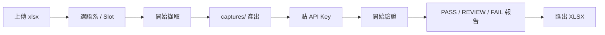
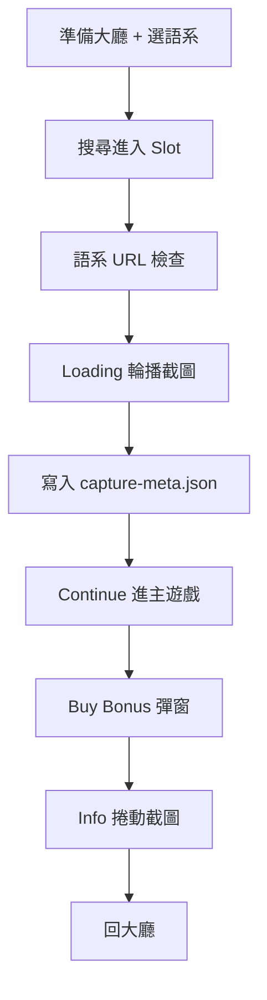
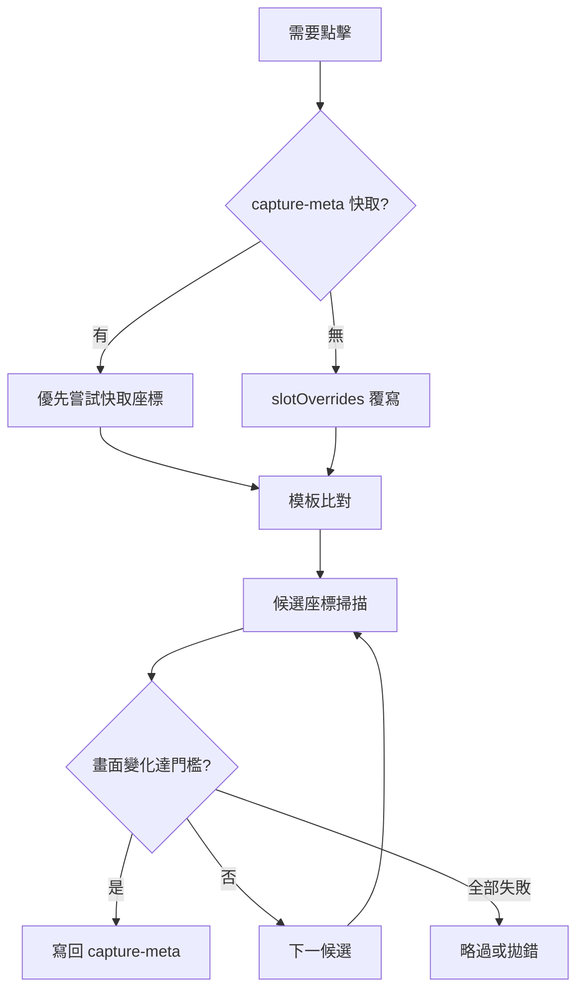
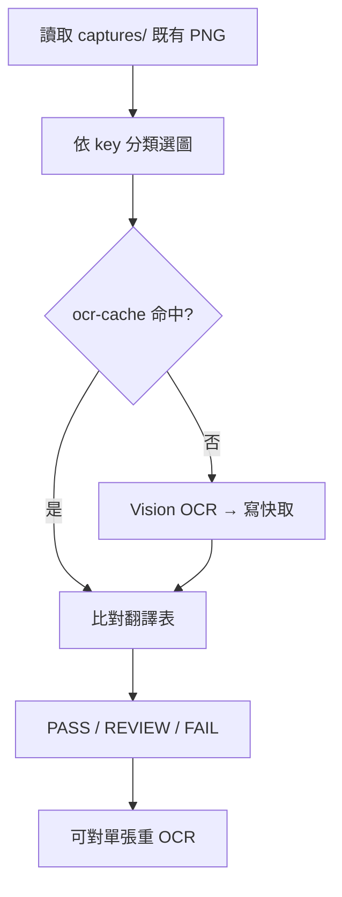

# L10n 擷圖 + 驗證（階段 A + C）

Playwright 自動擷取 Canvas 遊戲截圖（階段 A），並以 Vision OCR 比對畫面文字是否與翻譯表一致（階段 C），全程同一個 UI 完成。

## 功能

- **每次上傳 xlsx**（與 l10n 比對工具相同流程），選工作表如 `S015` ↔ 大廳 `Slot015`
- 環境：DEV / UAT / PP（預設 UAT）
- **語系**：上傳 xlsx 後從欄名自動帶入（如 `Bangla(bn)`、`泰文(th)`）；驗證支援 xlsx 內所有語系
- Viewport：**1920 × 911**（由 CDP 固定，截圖/點擊不受實體視窗大小影響）
- 產出：`captures/{env}/{lang}/{SlotId}/`

### 新增語系

xlsx 欄名含括號代碼（如 `English(en)`）即可出現在下拉選單。`config.default.json` 已內建大廳語系對照（`portalLabel` 為截圖中的繁中簡稱：英文、繁中、泰文…）。若本機有 `config.json`，會與預設**合併** `langMap`（不會整包覆蓋）；新語系代碼仍須在 `langMap` 補上 `portalLabel` 才能擷取。

| xlsx 代碼 | 大廳選單 (portalLabel) |
|-----------|------------------------|
| en | 英文 |
| zh-Hant | 繁中 |
| zh-Hans | 簡中 |
| th | 泰文 |
| ko-KR | 韓文 |
| pt | 葡萄牙文 |
| vi | 越南文 |
| id | 印尼文 |
| my-MM | 緬甸文 |
| es-ES | 西班牙文 |
| tr-TR | 土耳其文 |
| ja-JP | 日文 |
| bn | 孟加拉文 |

流程：上傳 xlsx → 選語系 → 複選 Slot → **開始擷取** → **開始驗證**。

### 視窗固定在單一螢幕（避免跨雙螢幕）

`config.default.json` 的 `window` 控制瀏覽器外框位置與大小（與 viewport 無關）：

```json
"window": {
  "position": { "x": 0, "y": 0 },
  "size": { "width": 1280, "height": 800 }
}
```

- **螢幕 1**：`position.x = 0`
- **螢幕 2**（在右側）：把 `position.x` 設成螢幕 1 的寬度，例如 `1920`
- 視窗縮小不影響截圖（仍為 1920×911）

如需覆寫，在 `config.json`（非 default）設定同樣的 `window` 欄位即可。

## 流程圖

### UI 操作流



### 單款擷取流（`runSlotCapture`）



### Continue / Buy 點擊策略



- **Continue**：畫面變化 ≥ `continueEnterThreshold`（預設 30%）
- **Buy Bonus**：彈窗區域變化 ≥ `buyBonus.popupChangeThreshold`（預設 8%）

### 驗證流（階段 C）



## 擷取流程說明

每款 Slot 依序執行：

1. **大廳** — 切環境、選語系、搜尋並進入遊戲
2. **語系檢查** — 進入後驗證 URL `?l=` 等參數，不符則回大廳重試（`langCheck`）
3. **Loading** — 自動偵測輪播區（直版置中 / 橫版右側窄輪播），`mode: auto` 等畫面換頁；至少 2 張且回到第一張時結束（不一定固定 3 張）
4. **Continue** — 多候選點擊 + 畫面驗證，成功座標寫入 `capture-meta.json` → `continueClick`
5. **Buy Bonus**（可選）— 候選掃描開彈窗 → 截圖 → 關閉；成功座標寫入 `buyBonusClick`；無按鈕時預設略過（`buyBonus.optional: true`）
6. **Info** — 開啟說明面板、捲動截圖、關閉
7. **回大廳** — 準備下一款

`debug: true` 時會額外產出 `captures/.../_debug/` 除錯圖。單款失敗時若 `continueOnSlotError: true`（預設），批次會繼續下一款。

### `capture-meta.json`

每款擷取後寫入 `captures/{env}/{lang}/{SlotId}/capture-meta.json`，供 OCR 裁切與下次點擊快取：

| 欄位 | 說明 |
|------|------|
| `portraitLayout` | 是否為直版版面 |
| `loadingPromoRegion` | Loading 輪播偵測區（像素） |
| `promoTextRegion` | Loading OCR 裁切區 |
| `continueClick` | Continue 成功座標 `{ x, y, source }` |
| `buyBonusClick` | Buy Bonus 成功座標 `{ x, y, source }` |

點擊失敗時會清除對應快取，下次重新掃描候選。

### 每款 Slot 覆寫（`config.json`）

針對版面特殊的 Slot，可在 `config.json` 覆寫候選座標（不必改程式）：

```json
{
  "continue": {
    "slotOverrides": {
      "Slot024": {
        "candidates": [{ "x": 960, "y": 810 }],
        "fractions": [{ "fx": 0.5, "fy": 0.89 }],
        "skipTemplates": false
      }
    }
  },
  "buyBonus": {
    "slotOverrides": {
      "Slot024": {
        "landscapeCandidates": [{ "x": 280, "y": 480 }],
        "landscapeFractions": [{ "fx": 0.12, "fy": 0.35 }],
        "skipTemplates": true
      }
    }
  }
}
```

## 安裝

需要 **Node.js 20+**（使用內建 `node --test`）。

```powershell
cd tools\l10n-capture
npm.cmd install
```

> PowerShell 若出現「已停用指令碼執行」，請用 `npm.cmd` / `npx.cmd`。

## 首次登入

```powershell
npm.cmd run save-auth
```

在開啟的瀏覽器手動登入大廳，回到終端機按 Enter，會寫入 `.auth/lobby.json`（勿提交 git）。

## 啟動 UI（推薦）

```powershell
npm.cmd start
```

開啟 http://localhost:3847（可用環境變數 `PORT` 覆寫）→ 上傳 xlsx → 選工作表 → 開始擷取。

## CLI

```powershell
# 單語系、單款
node capture-cli.js --env uat --lang bn --slot Slot015 --xlsx "C:\path\多國語系表(新版).xlsx"

# 多款
node capture-cli.js --env uat --lang bn --slot Slot015,Slot002 --xlsx "..."

# xlsx 內所有可擷取語系
node capture-cli.js --all-langs --env uat --slot Slot015 --xlsx "..."
```

## 遊戲內模板（候選點擊之一）

從你提供的截圖產生模板：

```powershell
npm.cmd run prepare-templates -- "右箭頭.png" "繼續按鈕整顆.png" "BuyBonus按鈕整顆.png"
```

會產生：

- `loading_arrow_right.png` — 右方向鍵
- `continue_btn_cap.png` — 繼續按鈕**左側金邊**（無文字，各語系通用）
- `buy_bonus_btn.png` — Buy Bonus **左側圖示區**（無文字，各語系通用；第三參數可選）

擷取時 **Continue / Buy Bonus 採多候選掃描**（快取 → slotOverrides → 模板 → 座標候選），以畫面變化驗證是否點中；模板只是候選來源之一，找不到時 fallback `canvasClicks` / `continueCandidates`。

### Buy Bonus 彈窗（`buy_popup.png`）

流程：進入主遊戲 → **候選點擊 Buy Bonus** → 截彈窗 → 關閉 → 再擷取 Info。

- 產出：`buy_popup.png`（或 `buyBonus.outputFile`）
- 橫版預設沿左側 `landscapeFySweep` 掃描（`config.default.json` → `buyBonus`）
- 驗證：`/^Buy/i` 的 key（`Buy_Bet`、`BuyBonus_1`…）只比對 `buy_*.png`
- 無 `buy_bonus_btn.png` 且無成功候選時預設**略過**（`buyBonus.optional: true`），不阻斷 Loading / Info 擷取

## Canvas 點擊 fallback（Unity 遊戲內）

遊戲內操作需點 `#unity-canvas` 相對座標，設定於 `config.default.json` → `canvasClicks`：

| Key | 用途 | 預設座標 |
|-----|------|----------|
| `loading_arrow_right` | Loading 右方向鍵 | 1225, 298 |
| `continue_btn` | 進入主遊戲 | 996, 608 |
| `buy_bonus_btn` | 開啟 Buy Bonus 彈窗 | 280, 480 |
| `buy_bonus_close` | 關閉 Buy 彈窗（X） | 1856, 68 |

另有 `continueCandidates`（頁面絕對座標）與 `continueCanvasFractions`（canvas 比例座標）作為 Continue 掃描候選。可用 Playwright codegen（viewport 1920×911）重新錄製後寫入 `config.json` 覆寫。

## 模板圖

將以下 PNG 放入 `templates/game/`（可覆寫座標於 `config.json`）：

- `menu.png` — 菜單 ☰
- `info.png` — Info (i)
- `home.png` — 菜單展開後的房子
- `info_close.png` — Info 關閉 X
- `buy_bonus_btn.png` — Buy Bonus 按鈕圖示（無文字）
- `loading_arrow_right.png` — Loading 右箭頭
- `continue_btn_cap.png` — 繼續按鈕金邊（無文字）

## 產出範例

```
captures/uat/bn/Slot015/
  capture-meta.json
  Loading_1.png … Loading_N.png
  buy_popup.png
  info_scroll_01.png … info_scroll_NN.png
  ocr-cache.json          ← 驗證後產生
  _debug/                 ← debug: true 時
```

## 階段 C：驗證（同一個 UI）

擷取完成後，於 UI 第 3 區：

1. 選擇 **Gemini** 或 **Siraya** 提供者，貼上對應 API Key（存於本機 `localStorage`，與測案工具共用 `gemini_api_key` / `siraya_api_key`），選模型。
2. 確認上方 Slot 清單（會驗證對應的 `captures/{env}/{lang}/{SlotId}` **既有截圖**，不需重新擷取）。
3. 點 **開始驗證** → 後端依工作表 key **只 OCR 需要的截圖**（Loading / Info / Buy / 其他分類），並依 `capture-meta.json` 裁切 Loading 文案區；送 API 前會縮圖為 JPEG，結果寫入 `ocr-cache.json`；**重驗**時未變動的圖直接讀快取。可勾選「強制重新 OCR」略過快取。
4. 結果表顯示每個 key 的「預期文案 / 相似度 / 狀態 / 來源圖 / OCR 片段」，可點擊 PASS / REVIEW / FAIL 篩選表格；FAIL / REVIEW 列可對**單張來源圖重 OCR**；並可 **匯出 XLSX**。

### Token 節省（`config.default.json` → `verify`）

| 機制 | 說明 |
|------|------|
| OCR 快取 | `captures/.../SlotXXX/ocr-cache.json`，依檔名 + mtime 跳過未變圖 |
| 縮圖 | 寬度上限 1280px、JPEG quality 85 再送 Vision API |
| 選擇性 OCR | 工作表只有 Loading key 時不 OCR info_scroll 等無關圖 |
| Loading 合併 | 多張 `Loading_*.png` 合併 1 次 Vision API（依 `promoTextRegion` 裁切） |
| Loading 跨張配對 | OCR 結果與各張 Loading 截圖做最佳配對，順序可能 ≠ 檔名順序 |
| info_scroll 去重 | 相鄰捲動畫面相似時略過 OCR（沿用上一張文字） |
| maxOutputTokens | 4096 |

驗證完成後日誌會顯示 **token 用量**（若 API 回傳 `usage` / `cost`）；多 Slot 結束時會印 **本次用量摘要**。

快取會在 provider / model / 縮圖寬度變更時自動重建。

### 比對模式（覆蓋式）

一張 info 截圖含多個 key 的文字，因此採覆蓋式比對：把翻譯表中該 Slot（工作表 `S0xx`）的字串，逐一在該 Slot 的 OCR 全文裡用滑動視窗（`normalize` + LCS 相似度）尋找最佳命中。

| 狀態 | 條件 |
|------|------|
| PASS | 相似度 ≥ 95% |
| REVIEW | 85% – 94% |
| FAIL | < 85%（畫面找不到該翻譯，或 OCR/翻譯不符） |

> 改動 `server.js` 後請**重啟** `npm.cmd start` 才會生效。

## 測試

純邏輯單元測試（不需啟動瀏覽器）：

```powershell
npm.cmd test
```

涵蓋 Loading 輪播區、文字比對、點擊策略、工作表解析、驗證流程等模組。

## API 摘要（整合平台用）

| 方法 | 路徑 | 說明 |
|------|------|------|
| GET | `/api/status` | 是否在擷取 / 驗證 |
| GET | `/api/lang-map` | 語系對照表 |
| POST | `/api/capture` | NDJSON 串流擷取 |
| POST | `/api/verify` | NDJSON 串流驗證 |
| POST | `/api/verify-reocr` | 單張來源圖重 OCR 並更新快取 |
| POST | `/api/verify-paste` | 手動貼 OCR 文字比對（除錯用） |
| GET | `/api/captures/:env/:lang/:slotId/:file` | 讀取產出 PNG |

程式對外入口：`lib/capture-flow.js`（re-export `runSlotCapture`、`loadConfig` 等）。

### `lib/` 模組地圖（維護者）

| 模組 | 職責 |
|------|------|
| `run-slot-capture.js` | 單款擷取編排 |
| `lobby-flow.js` | 大廳、進入 Slot、語系檢查 |
| `loading-capture.js` | Loading 輪播截圖 |
| `continue-click.js` | Continue 候選點擊 + 快取 |
| `buy-bonus-capture.js` | Buy Bonus 開彈窗 + 快取 |
| `info-capture.js` | Info 開啟、捲動、回大廳 |
| `click-strategies.js` | 共用候選掃描與畫面驗證 |
| `capture-meta.js` | `capture-meta.json` 讀寫 |
| `verify.js` + `ocr-utils.js` | 階段 C OCR 與比對 |
| `ocr-client.js` | Gemini / Siraya Vision API 呼叫與 token 累加 |

## 勿提交 git

`.auth/`、`captures/`、`config.json` 已在 `.gitignore`；本機設定與擷取產出請勿 push。

## 路線圖

- **A**：產圖 + xlsx 上傳選 sheet ✅
- **C**：Gemini OCR + 逐 key 覆蓋式比對 + 報告 / 匯出 XLSX ✅
- **維護**：模組化重構 + `npm test` 回歸護欄 ✅
